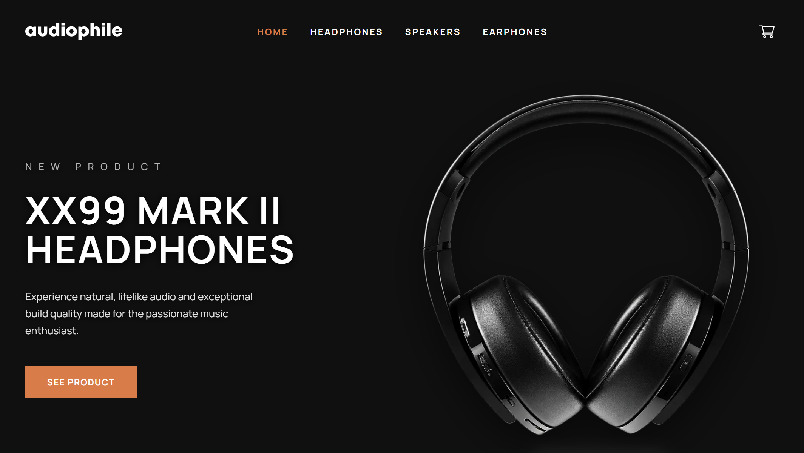

# Audiophile

A responsive ecommerce website for premium audio products.

I built this project to practise creating a complete shopping experience with Next.js: users can browse categories, explore products, manage a cart, and complete a demo checkout flow.

## Preview



## Features

- Responsive layouts for mobile, tablet, and desktop
- Headphones, speakers, and earphones category pages
- Dynamic product detail pages
- Product galleries and recommendations
- Persistent shopping cart using Local Storage
- Cart drawer with quantity controls
- Checkout form with validation
- Order confirmation screen
- Custom not-found page
- Custom SVG favicon
- Reusable UI components

## Accessibility

- Semantic page structure and headings
- Keyboard-accessible navigation and cart controls
- Visible focus states
- Accessible labels for buttons and form inputs
- Escape-key support in the cart drawer
- Focus management when the cart opens
- Meaningful alternative text for content images

## Built with

- Next.js
- React
- TypeScript
- Tailwind CSS
- React Icons
- Next.js Image Optimization
- Local Storage

## Getting started

Clone the repository:

```bash
git clone https://github.com/peterpaing/audiophile-store.git
cd audiophile-store
```

Install dependencies:

```bash
npm install
```

Run the development server:

```bash
npm run dev
```

Open [http://localhost:3000](http://localhost:3000) in your browser.

## Build for production

```bash
npm run build
```

## Project structure

```text
src/
├── app/
│   ├── (store)/
│   │   ├── category/
│   │   ├── products/[slug]/
│   │   ├── layout.tsx
│   │   └── page.tsx
│   ├── checkout/
│   ├── components/
│   ├── icon.svg
│   ├── layout.tsx
│   └── not-found.tsx
├── assets/
└── product-data.ts
```

## Notes

The cart is stored in the browser, so its contents remain after a page refresh.

This is a portfolio project. The checkout flow validates information and shows an order confirmation, but it does not process real payments or send data to a backend.

## Design reference

The project is based on the Audiophile ecommerce design challenge and includes custom interactions, cart behaviour, checkout flow, accessibility improvements, imagery, and branding.